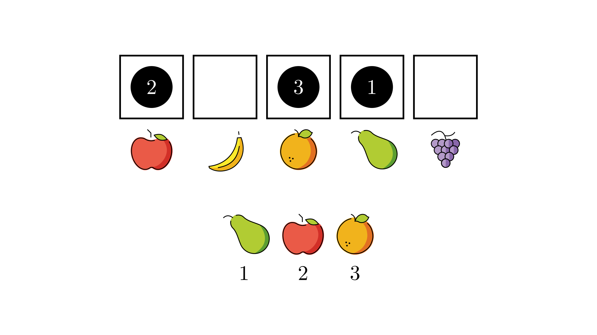

---
jupytext:
  formats: md:myst
  text_representation:
    extension:        .md
    format_name:      myst
    format_version:   0.13
    jupytext_version: 1.11.5
kernelspec:
  display_name: Dyalog APL
  language:     Dyalog APL
  name:         dyalog_apl
---

# Counting Functions

```{note}
This section assumes you're familiar with the notions of injective, surjective, and bijective functions.
```

- introduce balls and boxes analogy
- recall functions, injective, surjective, bijective
- `n*k` possible functions
- balls in boxes is function ball → box
- combinations are injective functions
- permutations are bijective functions
- next we'll count surjections

## Balls and Boxes

So far we've looked at two different counting problems: counting $k$-permutations and counting $k$-combinations. It turns out there's a way of looking at these problems which shows an interesting way they are related, and lights the way towards understanding the problems we're going to see over the rest of this chapter.

In the previous section, we saw how we can represent a combination as a binary string:

```{code-cell}
'🍎🍌🍊🍐🍇'∊'🍎🍊🍐'
```

Suppose each character of this string corresponds to a box. Wherever a `0` appears, we leave the box empty. Wherever a `1` appears, we place a ball in the box. Each box represents an element of the original set, and placing a ball in the box represents selecting that element to be included in a combination.

The most important thing to notice about this analogy is this: the boxes are *labelled*, while the balls are *unlabelled*. Exactly which ball a box gets doesn't matter, since the balls are indistinguishable. However, which box a ball is placed in does matter, since that dictates which element of the set is chosen. In this sense, the boxes are labelled with the elements of the set.


This setup gives us an alternative statement of the combination problem: there are `k!n` ways to place $k$ unlabelled balls into $n$ labelled boxes, with at most one ball in each box.

In isolation this is not particularly enlightening, but things get more interesting when we notice that we can tweak the parameters of the problem in three different ways. We can change whether the balls are labelled, whether the boxes are labelled, and how many balls are allowed in each box. This gives way to a whole family of counting problems, and we'll be categorising them all in the next chapter. For now, let's see how changing just one part of the problem effects things.

Let's say that, instead of being indistinguishable, we're going to label our $k$ balls with `⍳k`. Now, it does matter exactly which ball goes into which box:


With labelled balls, the problem no longer corresponds to counting $k$-combinations. Instead, it corresponds to counting $k$-*permutations*. If we take the label of ball as the index in a $k$-permutation, placing the balls in the boxes corresponds to choosing which element is placed at each index.



In later sections, we're going to look at the other specific counting problems we can make by varying the labelling of both the balls and boxes. We're also going to look at how controlling the number of balls which can go into each box affects the problems we make.

# Inclusion-Exclusion and Counting Partitions

- binary inclusion exclusion
    - `≢a∪b ←→ +/≢¨a b (a∩b)`
- n-ary inclusion exclusion and proof
    - `≢⊃∪/as ←→ +/(≢⍤(⊃∩/) × ¯1*¯1+≢)¨ ⊂⍤/∘as⍤1⍉2⊥⍣¯1⍳¯1+2*≢as`
- counting derangements
    - `(!n)-+/((¯1*¯1+⊢)×!∘n×(!n-⊢))⍳n ←→ +/(¯1∘* × !∘n × (!n-⊢))0,⍳n ←→ (!n)×+/(¯1∘*÷!)0,⍳n`
- counting surjections using inclusion-exclusion
    - `k Surj n ←→ +/(!∘nׯ1∘*×k*⍨n-⊢)0,⍳n`
- stirling numbers (of the second kind) - set partitions is unlabelling boxes, so divide by `!n`
    - `k S n ←→ (!n)÷⍨k Surj n`
- stirling triangle and bell numbers

# Stars and Bars

- diagramssss
- unlabelled balls into labelled boxes
    - `'*|**||*|' ←→ '*|**||*|'[7 2 4 1 5 6 3 8]`
- ways to generate
    - combinations of bars from string
    - `k!k+n-1 ←→ (n-1)!k+n-1` ways
- surjective stars and bars
    - first pick k-n, then add n to each one
    - `(k-n)!k-1 ←→ (n-1)!k-1` ways

# Integer Partitions

- unlabelled balls, unlabelled boxes, any or at least 1 per box
- no closed form, but we can still generate
- young diagram
- conjugate partitions - equivalent counts theorem
- self conjugate partitions
    - `7 6 4 4 4 2 2 1`
- self conjugate partitions ←→ distinct odd partitions
- proof using hook numbers in young tableaux

# Twelvefold Teaser

- some combinations of labelling and numbering we haven't tried
- this is the topic of the next section
