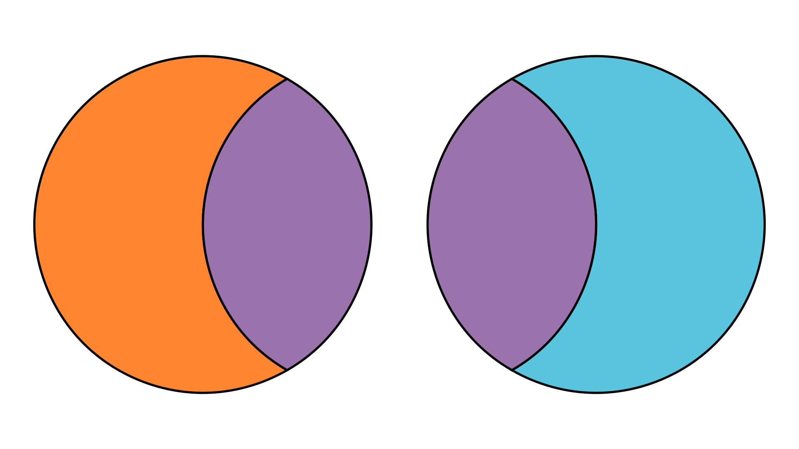

---
jupytext:
  formats: md:myst
  text_representation:
    extension:        .md
    format_name:      myst
    format_version:   0.13
    jupytext_version: 1.11.5
kernelspec:
  display_name: Dyalog APL
  language:     Dyalog APL
  name:         dyalog_apl
---

# Inclusion-Exclusion and Counting Partitions

- binary inclusion exclusion
    - `≢a∪b ←→ +/≢¨a b (a∩b)`
- n-ary inclusion exclusion and proof
    - `≢⊃∪/as ←→ +/(≢⍤(⊃∩/) × ¯1*¯1+≢)¨ ⊂⍤/∘as⍤1⍉2⊥⍣¯1⍳¯1+2*≢as`
- counting derangements
    - `(!n)-+/((¯1*¯1+⊢)×!∘n×(!n-⊢))⍳n ←→ +/(¯1∘* × !∘n × (!n-⊢))0,⍳n ←→ (!n)×+/(¯1∘*÷!)0,⍳n`
- counting surjections using inclusion-exclusion
    - `k Surj n ←→ +/(!∘nׯ1∘*×k*⍨n-⊢)0,⍳n`
- stirling numbers (of the second kind) - set partitions is unlabelling boxes, so divide by `!n`
    - `k S n ←→ (!n)÷⍨k Surj n`
- stirling triangle and bell numbers

The topic of this section will be counting surjective functions, but we need to build up some more tools before we can do that.

## The Inclusion-Exclusion Principle

Say we have two sets $a$ and $b$, and we want to know the size of their union. Of course, it's easy to just calculate this for specific examples:

```{code-cell}
a←'🍎🍌🍊🍐🍇🥑🫑'
b←'🍄🥕🫑🧅🥑'
a∪b
≢a∪b
```


If we add together the sizes of the two sets, we are overcounting relative to their union, as we're counting their intersection twice.



Therefore, the size of the union of two sets is the sum of their individual sizes, minus the size of the overcounted intersection:

```
≢a∪b ←→ (≢a)+(≢b)-≢a∩b
```

We can apply the same logic when we have three sets.


We're still counting the pairwise intersections twice each. When we subtract the sizes of the extra pairwise intersections, we end up subtracting the size of the intersection of all three sets three times over. Since this intersection appeared three times in the original sum (once in each set), this means we have uncounted all of the elements in the intersection of all three sets, so we need to add it back in. This gives us:

```
≢a∪b∪c ←→ (≢a)+(≢b)+(≢c)+(-≢a∩b)+(-≢a∩c)+(-≢b∩c)+≢a∩b∩c
```

The pattern emerging here is that we add the individual set sizes, substract the pairwise intersection sizes, add the triple-wise intersection sizes, subtract the quadruple-wise intersection sizes, and so on. This pattern gives us the *principle of inclusion and exclusion*: given a set $a$ of sets `a[1]` through `a[n]` where `n≡≢as`:

```
p←a⊂⍤/⍨⍤1⍉2⊥⍣¯1⍳¯1+2*≢a    ⍝ all non-empty subsets of a
⍝                      ┌───────┬─sizes of the intersections of all the sets in subsets
≢⊃∪/a ←→ +/(¯1*~2|≢¨p)×{≢⊃∩/⍵}¨p
⍝          └──────────┴─subtract if there are an even number of sets subsets, else add
```

In traditional mathematical notation, this is written as

$$
\left|\bigcup_{i=1}^na_i\right|=\sum_{\emptyset\ne J\subseteq[n]}(-1)^{|J|+1}\left|\bigcap_{j\in J}a_j\right|
$$

Let's see this in action:

```{code-cell}
a←'ABC' 'CD' 'EFG' 'FG' 'GH'
⊃∪/a
≢⊃∪/a
⍪p←a⊂⍤/⍨⍤1⍉2⊥⍣¯1⍳¯1+2*≢a
+/(¯1*~2|≢¨p)×{≢⊃∩/⍵}¨p
```

To prove that this is true, consider any element $x$ of `⊃∪/a`. Let $b$ be the subset of $a$ which contains only the sets which contain $x$.

```{code-cell}
⍝ for example
x←'G'
⊢b←(x∊¨a)/a
```

In the inclusion-exclusion formula, $x$ is counted once for each odd-sized subset of $b$, and uncounted once for every even-sized subset of $b$.Therefore, we have the following for $m$, the number of times $x$ is counted:

```
t←≢b
m←+/(1!t) (-2!t) .. ((¯1*1+t)×t!t)
```

By the binomial theorem (see [here](./combinations-and-bijective-proofs.md)), we have

```
0 ←→ (1-1)*t ←→ +/(0!t) (-1!t) .. ((¯1*t)×t!t) ←→ (0!t)-m
```

Since `1 ←→ 0!t`, $m$ must be equal to $1$, so $x$ is counted only once in the inclusion-exclusion formula.

### Derangements

To see a use of the principle of inclusion and exclusion, let's take a look at another counting problem.

A *derangement* is a permutation where no element stays in its original position.

```{code-cell}
a←1 2 3 4 5
b←4 1 2 5 3
c←3 1 5 4 2
a=b            ⍝ b is a derangement of a, no elements in the same place
a=c            ⍝ c is not a derangement of a, 4 is in the same place
```

How many derangements are there of $n$ elements?

We already know that there are `!n` permutations of $n$ elements. Let $s$ be the set of sets such that `s[k]` is the set of permutations which fix the $k$th object in place. There will be `!n-1` permutations in this set, since one object is no longer free to move.

```{code-cell}
⍝ for example
n←3
s←⍬
s,←⊂(1 2 3) (1 3 2)    ⍝ permutations which fix 1
s,←⊂(1 2 3) (3 2 1)    ⍝ permutations which fix 2
s,←⊂(1 2 3) (2 1 3)    ⍝ permutations which fix 3
⍪s
```

The set of derangements of $n$ elements is the set of permutations of $n$ elements, without the union of sets in $s$.

```{code-cell}
p←(1 2 3) (1 3 2) (2 1 3) (2 3 1) (3 1 2) (3 2 1)    ⍝ all permutations of 3 elements
p~⊃∪/s    ⍝ derangements of 3 elements
```

So, if we want to count the derangements of $n$ elements (and we don't want to generate them all to do it), we would take the number of permutations of $n$ elements (`!n`), and subtract the number of permutations which fix at least one object (`≢⊃∪/s`).

The intersection of any $i$ sets in $s$ will fix $i$ objects, and therefore will have `!n-i` elements. There are `i!n` ways to pick $i$ sets from $s$.

This gives us all the information we need to use the principle of inclusion and exclusion find `≢⊃∪/s`.

```
n←≢s
p←s⊂⍤/⍨⍤1⍉2⊥⍣¯1⍳¯1+2*n    ⍝ all nonempty subsets of s
≢⊃∪/s ←→ +/(¯1*1+≢¨p)×{≢⊃∩/⍵}¨p
      ←→ +/(¯1*1+i)×(i!n)×!n-i←⍳n               ⍝ we know exactly how big each subset will be, and how many subsets of that size there are
                                                ⍝ note that i here is all the possible values for i above in a vector
      ←→ +/(¯1*1+i)×((!n)÷(!i)×!n-i)×!n-i←⍳n    ⍝ expanding out the binomial coefficient
      ←→ +/(¯1*1+i)×(!n)÷!i←⍳n                  ⍝ !n-i cancels out
      ←→ (!n)×+/(¯1*1+i)÷!i←⍳n                  ⍝ factoring out !n
```

Therefore, the number of derangements is

```
(!n)-≢⊃∪/s ←→ (!n)-(!n)×+/(¯1*1+i)÷!i←⍳n
           ←→ (!n)×1-+/(¯1*1+i)÷!i←⍳n      ⍝ factor out !n
           ←→ (!n)×  +/(¯1*  i)÷!i←0,⍳n    ⍝ the - cancels out the 1+, and we can absorb the 1 into the sum by adding 0, to i
           ←→ (!n)×+/(¯1∘*÷!)0,⍳n          ⍝ in tacit form
```

```{code-cell}
NDerangements←{(!⍵)×+/(¯1∘*÷!)0,⍳⍵}
NDerangements¨⍳10    ⍝ https://oeis.org/A000166
```

```{admonition} Aside
The sum in the formula we just derived is actually the Taylor polynomial for $e$ (`*1`), so we could also write

`NDerangements←⌊.5+(*1)÷⍨!`
```

## Counting Surjections

# Stars and Bars

- diagramssss
- unlabelled balls into labelled boxes
    - `'*|**||*|' ←→ '*|**||*|'[7 2 4 1 5 6 3 8]`
- ways to generate
    - combinations of bars from string
    - `k!k+n-1 ←→ (n-1)!k+n-1` ways
- surjective stars and bars
    - first pick k-n, then add n to each one
    - `(k-n)!k-1 ←→ (n-1)!k-1` ways

# Integer Partitions

- unlabelled balls, unlabelled boxes, any or at least 1 per box
- no closed form, but we can still generate
- young diagram
- conjugate partitions - equivalent counts theorem
- self conjugate partitions
    - `7 6 4 4 4 2 2 1`
- self conjugate partitions ←→ distinct odd partitions
- proof using hook numbers in young tableaux

# Twelvefold Teaser

- some combinations of labelling and numbering we haven't tried
- this is the topic of the next section

